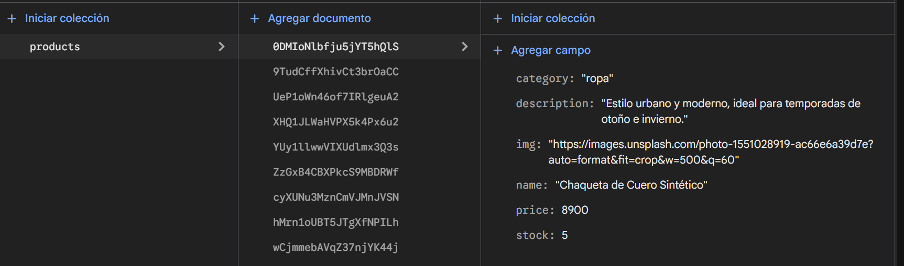
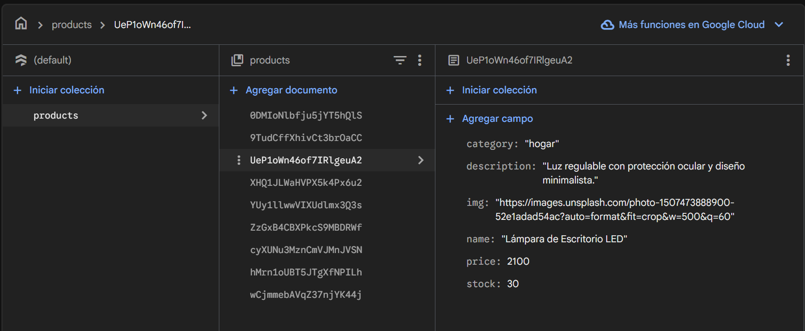
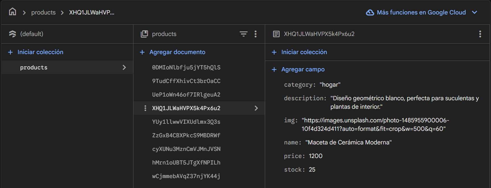
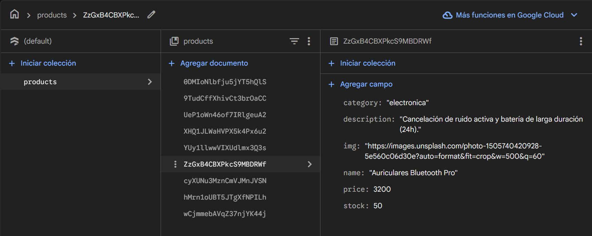
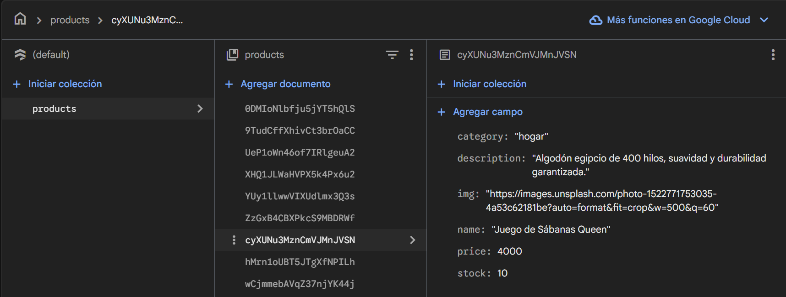
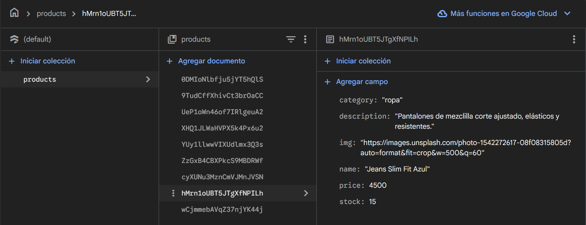
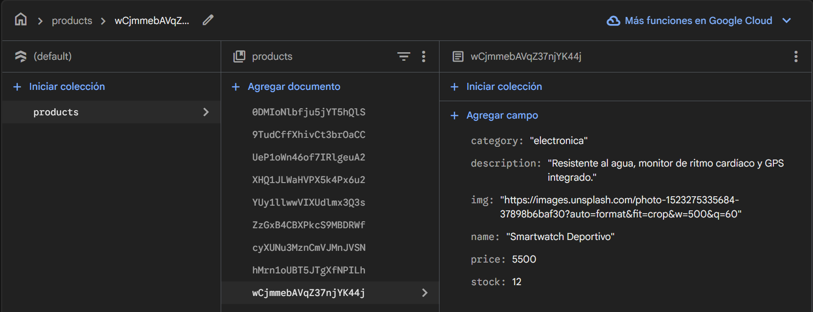

🛒 E-commerce App - Entrega Final

Este proyecto representa la versión final del e-commerce desarrollado con React.js. Se trata de una Single Page Application (SPA) completamente funcional que integra navegación, gestión de estado global y persistencia de datos en la nube.
La aplicación simula el flujo completo de compra: desde la navegación por categorías y visualización de productos, hasta la gestión del carrito y la generación de órdenes de compra en base de datos.

🚀 Funcionalidades Principales
1. 📦 Catálogo Dinámico (Firebase)
Los productos se obtienen en tiempo real desde una colección en Firestore.
Filtrado por Categoría: Navegación fluida entre diferentes categorías (Ropa, Electrónica, Hogar) actualizando la vista sin recargar la página.
Detalle de Producto: Vista individual (/item/:id) que carga la información específica de un producto mediante su ID.

2. 🛒 Gestión del Carrito (Context API)
Implementación de un CartContext para manejar el estado global.
Funciones incluidas:
addItem: Agrega productos evitando duplicados.
removeItem: Elimina un producto específico.
clearCart: Vacía el carrito completo.
totalQuantity y total: Cálculos automáticos para el widget y el resumen de compra.
Persistencia: El estado del carrito se mantiene mientras se navega por la app.

3. 💳 Checkout y Órdenes
Formulario de validación para finalizar la compra.
Generación de Orden: Al confirmar, se crea un documento en la colección orders de Firebase que incluye:
Datos del comprador.
Items comprados.
Total de la transacción.
Fecha y hora (Server Timestamp).
Feedback: Se muestra al usuario el ID de seguimiento de su compra generado por la base de datos.

🛠️ Stack Tecnológico
Frontend: React JS (Vite)
Navegación: React Router DOM v6
Estilos: CSS Modules / Tailwind CSS
Base de Datos: Firebase Firestore (NoSQL)
Iconos: Lucide React

🔥 Configuración de Firebase
Para ejecutar este proyecto, es necesario configurar un proyecto en Firebase.
1. Credenciales
Crea un archivo llamado src/firebase/config.js (este archivo suele estar en .gitignore por seguridad) con el siguiente contenido:
// src/firebase/config.js
import { initializeApp } from "firebase/app";
import { getFirestore } from "firebase/firestore";

const firebaseConfig = {
  apiKey: "TU_API_KEY",
  authDomain: "TU_PROYECTO.firebaseapp.com",
  projectId: "TU_PROJECT_ID",
  storageBucket: "TU_PROYECTO.appspot.com",
  messagingSenderId: "TUS_NUMEROS",
  appId: "TU_APP_ID"
};

const app = initializeApp(firebaseConfig);
export const db = getFirestore(app);

2. Reglas de Seguridad (Firestore Database)
Para el correcto funcionamiento de la lectura de productos y la creación de órdenes, utiliza estas reglas en la consola de Firebase:
rules_version = '2';
service cloud.firestore {
  match /databases/{database}/documents {
    
    // Productos: Lectura pública, escritura restringida (para no borrar el catálogo)
    match /products/{document=**} {
      allow read: if true;
      allow write: if false; 
    }
    
    // Órdenes: Permitir a cualquiera crear una compra
    match /orders/{document=**} {
      allow create: if true;
      allow read, update, delete: if false;
    }
  }
}

🏗️ Estructura del Proyecto
La arquitectura sigue el patrón de separación entre Contenedores (lógica) y Componentes de Presentación (UI).
src/
├── components/          (Componentes Visuales)
│   ├── NavBar/          # Navegación y Logo
│   ├── CartWidget/      # Icono del carrito con contador (consume Context)
│   ├── ItemList/        # Mapeo de productos
│   ├── Item/            # Card individual de producto
│   ├── ItemDetail/      # Vista extendida del producto
│   ├── ItemCount/       # Contador de stock
│   ├── Cart/            # Vista de resumen de compra
│   └── Checkout/        # Formulario final de compra
│
├── containers/          (Lógica y Conexión a Datos)
│   ├── ItemListContainer/   # Fetch de productos y filtro por categoría
│   └── ItemDetailContainer/ # Fetch de un solo producto por ID
│
├── context/
│   └── CartContext.jsx  # Lógica global del carrito
│
├── firebase/
│   ├── config.js        # Configuración (Ignorado por Git)
│   └── uploadProducts.js # Script de carga inicial (Utility)
│
├── App.jsx              # Configuración de Rutas (Router)
└── main.jsx             # Punto de entrada

📦 Instalación y Ejecución Local
Clonar el repositorio:
git clone https://github.com/Aalexalmaguer/ProyectoFinalReact-Almaguer

Instalar dependencias:
npm install

Ejecutar el servidor de desarrollo:
npm run dev

